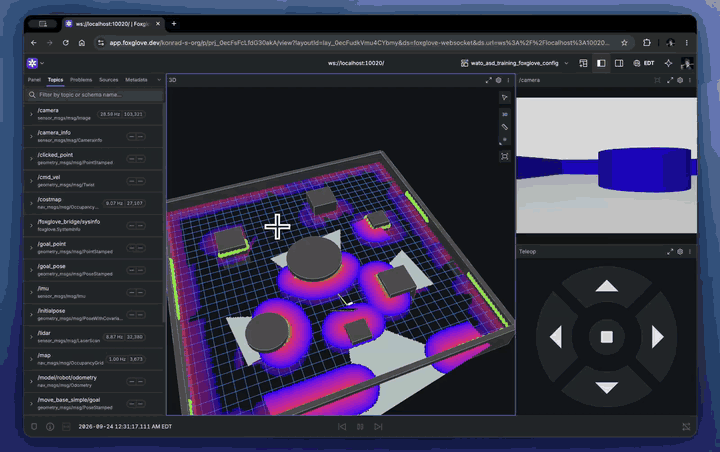

# Autonomous Robot Navigation (ROS 2)

A robot that drives itself. You click a spot on the map, and it plans a route around obstacles and drives there without hitting anything.

Built on ROS 2 Humble in a Gazebo simulation, for the [WATonomous](https://www.watonomous.ca/) ASD admission assignment.



[Watch the full demo video (37 s)](docs/media/demo.mp4)

**In the video:**
- **Green dots:** what the lidar sees right now.
- **Purple and red glow:** the danger zone around each obstacle. Red means too close to drive, and it fades to purple as it gets safer.
- **Light grey areas:** space the robot has already scanned and knows is empty.
- **Clicked point:** the goal. The robot finds a path and drives there on its own.

## How it works

The robot has one sensor, a spinning laser (lidar), plus its own position. Four programs (ROS 2 nodes) pass data down a chain:

```
lidar ──► Costmap ──► Map Memory ──► Planner ──► Control ──► wheels
          "what's     "remember     "find a      "steer
           near me"    everything"   route"       along it"
```

| Node | Job |
|---|---|
| **Costmap** | Turns each lidar scan into a 20 × 20 m grid around the robot. Every cell gets a danger score from 0 to 100. |
| **Map Memory** | Stitches those local grids into one 30 × 30 m map of the whole arena, so the robot remembers walls it can't see anymore. |
| **Planner** | Runs A\* on the map to find the safest short route to the goal. |
| **Control** | Follows the route with Pure Pursuit: aim at a point 1.2 m ahead on the path and steer toward it. |

## Features

- **Click to go.** Click anywhere in Foxglove and the robot drives there.
- **Stays away from walls.** Obstacles get a 2.2 m danger zone that fades out. The planner treats anything closer than about 1.1 m as a wall and pays extra to drive near the rest, so routes go through the middle of gaps.
- **No corner cutting.** The route can't slip diagonally between two blocked cells.
- **Fast when it's safe.** It drives up to 2 m/s when the next 3 m of path is straight and the goal is far away. It slows to 0.3 m/s for turns and near the goal.
- **Turns around in tight spots.** If the target is more than about 45° off to the side, it stops and turns on the spot before driving.
- **Fixes bad goals.** Click too close to a wall and it picks the nearest safe spot instead of giving up.
- **Recovers when stuck.** If it stops making progress for 3 seconds, it plans a new route.

## Key decisions

**1. Plan for the middle of the robot, not the sensor.**
The position the robot reports is the lidar, which sits 0.8 m in front of the body's centre. Planning from the lidar made the back of the robot clip corners. Everything now plans and steers from the body's centre.

**2. Remember the worst thing ever seen in each cell.**
When a new scan lands on the map, a cell only gets more dangerous, never safer. Before this, one scan that missed a wall could wipe it off the map, and the robot would drive into it.

**3. Place each scan where the robot actually was.**
A lidar scan takes time to process, and the robot keeps moving. Map Memory keeps 2 seconds of position history and places each scan at the position the robot had when it was taken. If the robot jumped more than 1 m (a teleport or a glitch), that scan is thrown away. Without this, fast turns left ghost walls on the map.

**4. Clear the space the laser passes through.**
Each laser beam that travels 8 m before hitting something proves those 8 m are empty. Marking that space as free got rid of the big grey "unknown" square that used to surround the robot.

**5. Ignore hits closer than 0.4 m.**
Those are the robot seeing its own body.

**6. Turn on the spot slowly.**
Spinning at full speed made the wheels slip and the body slide sideways. That was enough to nearly hit a wall when turning around in a corner. Turning on the spot is capped at 0.8 rad/s.

**7. Pick the truly closest safe goal.**
The first version searched outward and took the first free cell it found, which always nudged goals down and to the left. Sometimes that was deeper into the corner the robot was trying to leave. Now it picks the closest free cell and, if there's a tie, the one nearest the robot.

## Testing

`tests/nav_scenarios.py` runs 10 hard situations. Each one teleports the robot to a tricky starting spot, sends a goal, and checks four things:

- The robot reaches the goal (within 0.6 m).
- It never stalls for 12 seconds.
- Its body stays at least 10 cm from every wall, box, and cylinder.
- It never tips more than 15°.

| Scenario | What makes it hard | Result |
|---|---|---|
| `corridor_uturn` | 180° turn inside a 3.75 m corridor | ✅ |
| `box_hairpin` | Goal directly behind a box | ✅ |
| `diagonal_gap` | 3.8 m gap between two box corners | ✅ |
| `corner_dive` | Drive into the arena corner | ✅ |
| `corner_escape` | Start facing into the corner, goal behind | ✅ |
| `north_gap_hairpin` | Narrow gap, then a U-turn | ✅ |
| `box_squeeze` | 4.3 m diagonal gap between boxes | ✅ |
| `goal_by_box` | Goal right at the edge of the danger zone | ✅ |
| `fast_corner` | Sharp turn right after a fast straight | ✅ |
| `long_straight` | 22 m straight at full speed, then stop | ✅ |

**10/10 pass.** The closest the body got to anything was 0.27 m, and the top speed was 2.5 m/s.

Run the tests (with the stack already running):

```bash
./tests/run_nav_scenarios.sh              # all 10
./tests/run_nav_scenarios.sh corner_escape # just one
./tests/run_nav_scenarios.sh --list        # describe each scenario
```

## Run it yourself

You need Docker (Docker Desktop on Mac). Everything else, ROS included, runs inside containers.

```bash
git clone https://github.com/konradtabay/wato_asd_training.git
cd wato_asd_training
cp watod-config.local.sh.example watod-config.local.sh   # on Apple Silicon, set PLATFORM="arm64"
./watod build
./watod up
```

Then open [Foxglove](https://app.foxglove.dev) and connect to `ws://localhost:<port>`. The port number is in `modules/.env` under `FOXGLOVE_BRIDGE_PORT`. Import the layout from `config/`, then click in the 3D view to send a goal.

The full setup guide, including Apple Silicon fixes, is in [SETUP.md](SETUP.md).

## Code layout

```
src/robot/
  costmap/       lidar scan → local danger grid
  map_memory/    local grids → one global map
  planner/       A* route planning
  control/       Pure Pursuit steering and speed
  bringup_robot/ launch file that starts all of the above
tests/           navigation stress tests
```

Each node is split into a `*_core` file, which holds the logic, and a `*_node` file, which handles ROS topics and parameters. That keeps the algorithms easy to read and test. All the tuning numbers live in each package's `config/params.yaml`.

## Credits

- Starter code, simulation world, and Docker tooling by [WATonomous](https://github.com/WATonomous/wato_asd_training).
- First version of the control node by Sonia O.
- Assignment spec: [WATonomous wiki](https://wiki.watonomous.ca/admission_assignments/asd_admission_assignment/).
